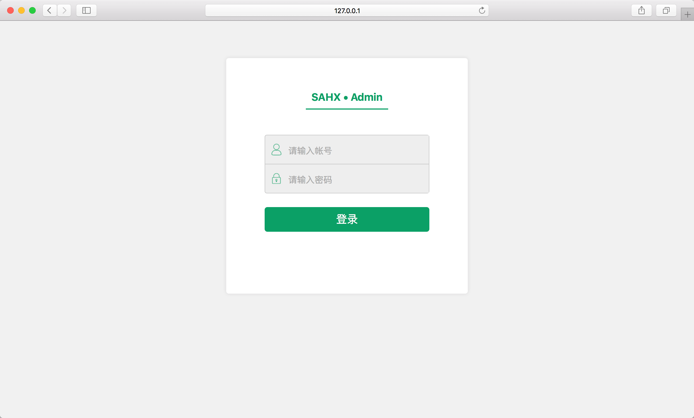
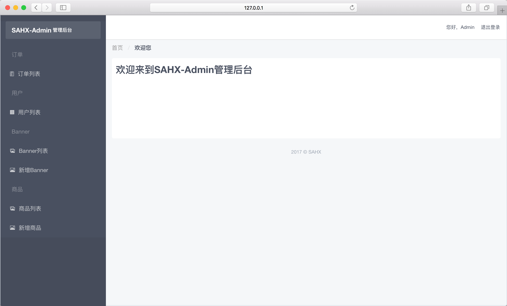

# SAHX 后台管理系统

## 简介
 SAHX-Admin-iview 是套功能较为完整的后台管理系统架构, 以[Thinkjs](https://github.com/75team/thinkjs)作为中间层, [Vuejs](https://github.com/vuejs/vue)作为前端模块化开发, [iview](https://www.iviewui.com/)作为前端UI, 实现了前后端分离, 前端组件化,
 便于多人协同开发.

<div  align="center">
    
</div>
<br/>
<div  align="center">
    
</div>


## 技术前提
   - 熟悉nodejs以及npm
   - 掌握[Thinkjs](https://github.com/75team/thinkjs)
   - 掌握[vuejs@2.x](https://cn.vuejs.org/v2/guide/) ，[vue-router@2.x(路由)](https://router.vuejs.org/zh-cn/) ，[Vuex@2.x(状态管理架构)](https://vuex.vuejs.org/zh-cn/)
   - 了解[iview](https://www.iviewui.com/)
   - 了解[webpack2.0基本使用](http://www.css88.com/doc/webpack2)

## 跑起来试试
##### 1 安装依赖

```
npm install
```
##### 2 前端编译（主要编译front里的vue文件）
```
npm run build
```

##### 3 启动服务（默认8360端口）

```
npm start
```
##### 4 访问
```
http://127.0.0.1:8360
```

## PS：
SAHX-Admin-iview 继承于 [SAHX-Admin](https://github.com/SAHX/SAHX-Admin)，所有UI全部采用iview，不再依赖其它UI组件和JS库，相比[SAHX-Admin](https://github.com/SAHX/SAHX-Admin)更为简洁，组件化程度更高。但也因此web开发的灵活度有所降低，许多第三库您需要自己额外引入，或者您也直接使用[SAHX-Admin](https://github.com/SAHX/SAHX-Admin)